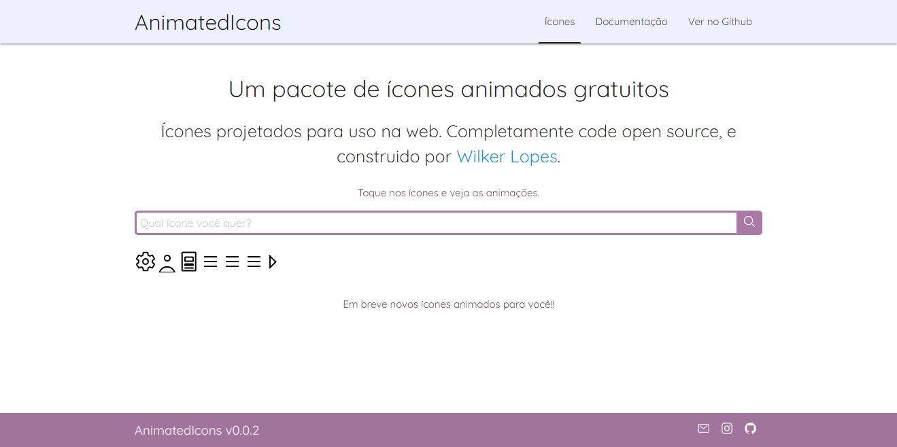
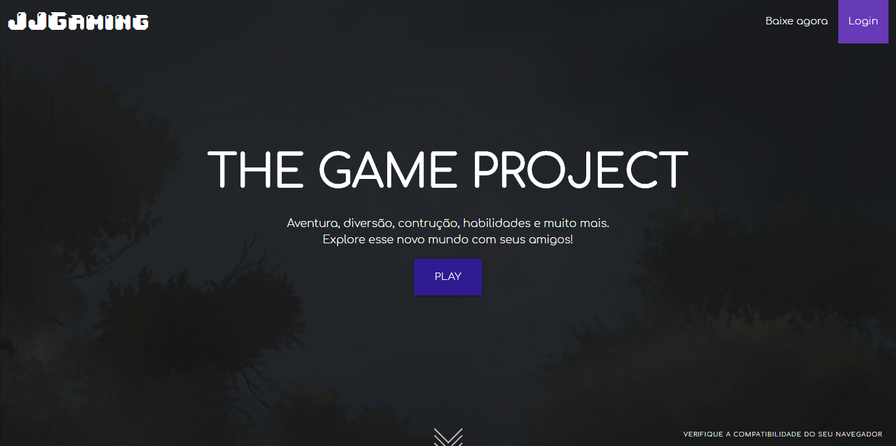

  

<h3 align="center">👋 Hi, me chamo Wikler Lopes</h3>

---

 Desenvolvedor de software.
      

## 📝 Table of Contents

- [Projetos](#project)
- [Idea / Soluções](#idea)
- [Futuro](#future)

## 🧐 Projetos 

- Biologia Digital - Site
- Biologia Digital - Mobile
- Gyzu - Site
- Jiquitaia Solidaria - Site

## 💡 Idéias / Solution 

Varias idéias que sempre gera um ótimo aprendizado. Elas surgem a partir de problemas do dia-a-dia, assim eu tento automatizar, melhorar, agilizar ou criar um software para realizar tais atividades.
Nem todas as ideias eu consigo colocar em prática, mas, sempre consigo deixalas prontas no papel, esperando para serem codificadas. Um dias elas vão sair do papel e estar disponivel para todos. Alguns exemplos de ideias que ja sairam do papel:

 AnimatedIcons 

    

Um pacote de Icones totalmente animados para web, os icones sao criados com HTM, CSS e alguns com SVG. As animações são feitas com css, mas com trigger por meio de script Essa é a idéia que eu mais expero ver um dia em pleno funcionamento e com força total. 
 
 

 JJGaming 

    

Uma plataforma de jogos simples, mas com jogos multiplayer disponível em multiplataformas. Só precisa de um navegador pra poder jogar. indepedente do dispositivo utilizado.

## 🚀 Futuro 

Gosto de aprender novas linguagens e melhorar sempre meus conhecimentos. Estudo com foco de torna-me um desenvolvedor Fullstack.

---

